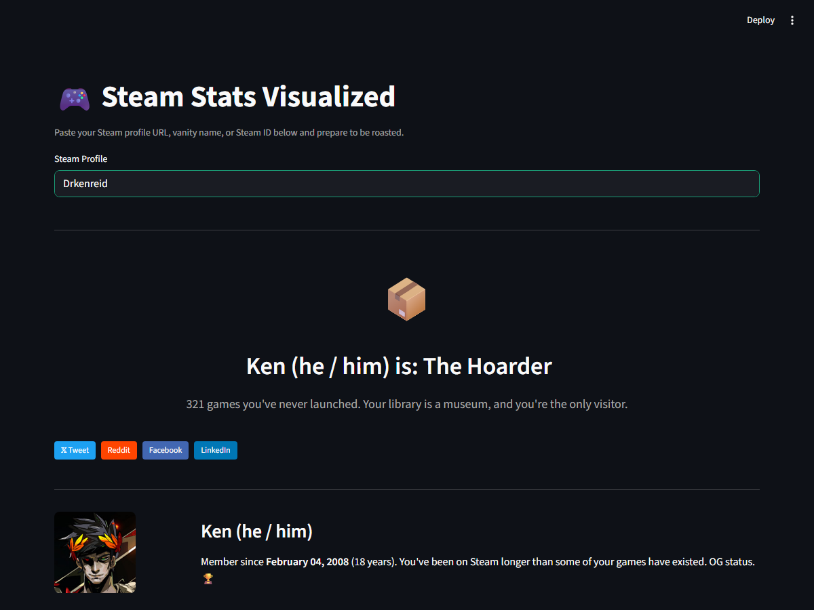
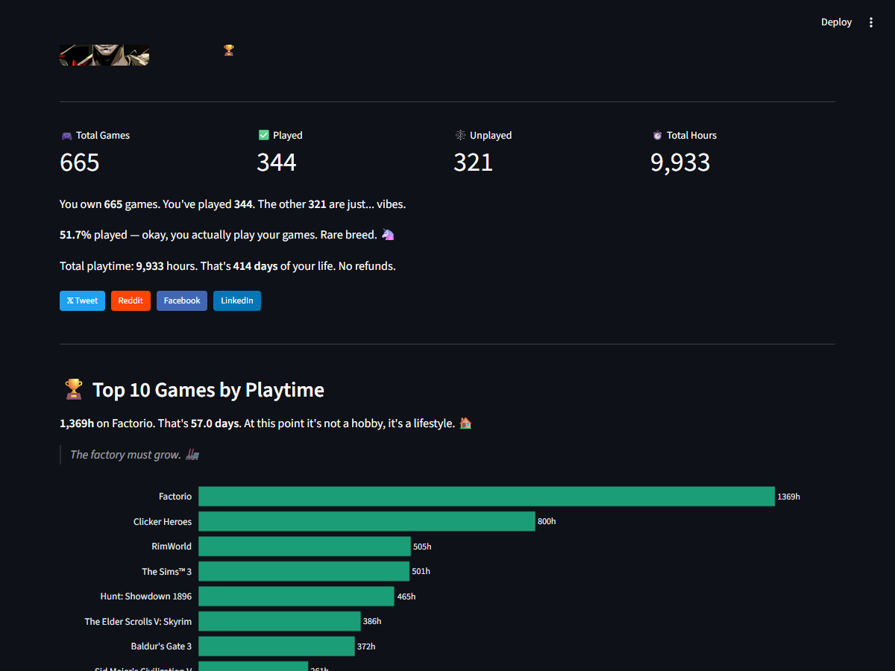
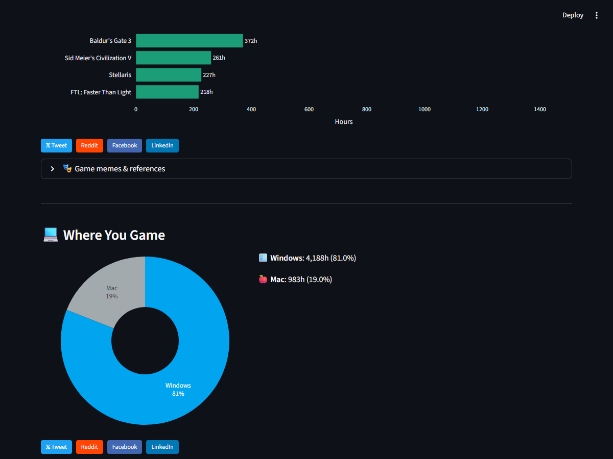
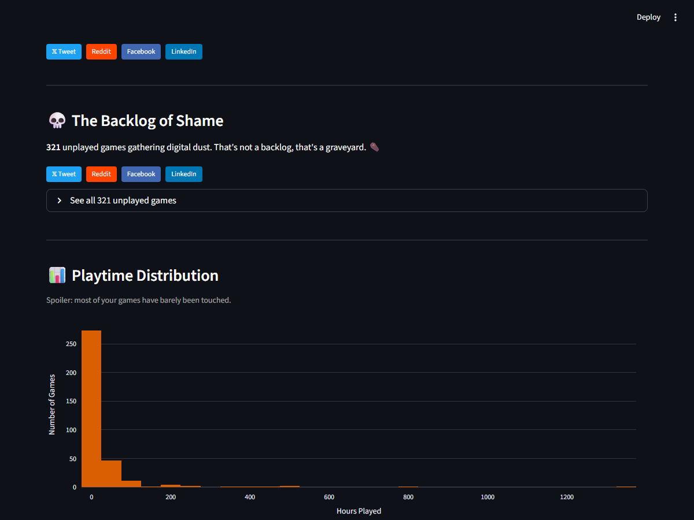
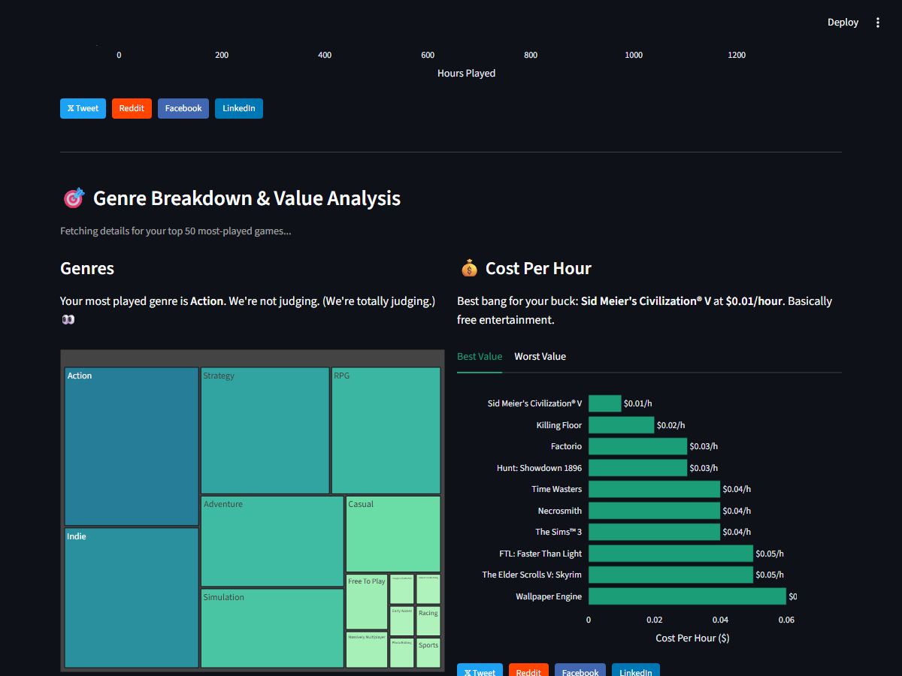

# 🎮 Steam Stats Visualized

**Spotify Wrapped, but for your Steam library.** Paste your profile, get roasted.

> *"You own 665 games. You've played 344. The other 321 are just... vibes."*

<!-- TODO: Replace with deployed Streamlit URL -->
<!-- [](https://steam-stats-visualized.streamlit.app) -->


---

## ✨ Features

| Feature | Description |
|---------|-------------|
| 🎭 **Gaming Personality** | Are you "The Hoarder", "The Completionist", or "The One-Game Andy"? |
| 🏆 **Top 10 Games** | Interactive bar chart of your most-played games with roast commentary |
| 🎮 **Game Meme References** | ~50 game-specific memes (Factorio: "The factory must grow" 🏭) |
| 💻 **Platform Breakdown** | Windows / Mac / Linux / Steam Deck playtime donut chart |
| 💀 **Backlog of Shame** | How many games you've never touched, with appropriate judgment |
| 📊 **Playtime Distribution** | Histogram showing the classic "200 games under 1 hour" pattern |
| 🎯 **Genre Breakdown** | Treemap of your library by genre |
| 💰 **Cost Per Hour** | Best and worst value games in your library |
| 💸 **Most Expensive Unplayed** | The priciest game you've never opened |
| 🏅 **Achievement Stats** | Completion rates across your top games |
| 🕹️ **Recently Played** | What you've been up to in the last 2 weeks |
| 📤 **Social Sharing** | Share buttons (Twitter, Reddit, Facebook, LinkedIn) on every section |

## 📸 Screenshots

<details>
<summary>Click to expand</summary>

### Gaming Personality + Profile


### Top 10 Games + Platform Breakdown


### Backlog of Shame + Playtime Distribution


### Genre Breakdown + Cost Analysis


### Achievement Stats + Recently Played


</details>

## 🚀 Try It

<!-- TODO: Add deployed URL -->
<!-- **[Use it live →](https://steam-stats-visualized.streamlit.app)** -->

Or run locally:

```bash
# Clone
git clone https://github.com/drkenreid/steam-stats-visualized.git
cd steam-stats-visualized

# Install dependencies
pip install -r requirements.txt

# Add your Steam API key (free: https://steamcommunity.com/dev/apikey)
cp .streamlit/secrets.toml.example .streamlit/secrets.toml
# Edit .streamlit/secrets.toml with your key

# Run
streamlit run app.py
```

Or with Docker:

```bash
docker build -t steam-stats .
docker run -p 8501:8501 steam-stats
```

Or with Make:

```bash
make run     # Start the app
make test    # Run tests
```

## 🏗️ Architecture

```
steam-stats-visualized/
├── app.py                    # Streamlit UI — layout, sections, share buttons
├── src/
│   ├── steam_api.py          # Steam API client (Web API + Store API), caching
│   ├── analytics.py          # Data processing, metrics, commentary, personality
│   └── charts.py             # Plotly chart builders (dark theme)
├── notebooks/
│   └── exploration.ipynb     # Data science EDA walkthrough
├── tests/
│   └── test_analytics.py     # Unit tests for analytics functions
├── .streamlit/
│   ├── config.toml           # Dark theme configuration
│   └── secrets.toml.example  # API key template
├── assets/screenshots/       # App screenshots
├── requirements.txt
├── Dockerfile
├── Makefile
└── LICENSE (MIT)
```

### Design Decisions

- **Streamlit** over Flask/React: Zero-friction deployment, Python-native, free hosting via Streamlit Community Cloud. The app IS the repo.
- **Plotly** over Matplotlib: Interactive charts that users can hover, zoom, and explore. Dark theme consistency.
- **No database**: All data fetched live from Steam APIs. Caching via `@st.cache_data` (1-hour TTL) to avoid hammering rate limits.
- **No OAuth**: Users paste a profile URL — no login required. Works with any public Steam profile.
- **Humor-driven**: The goal is shareability. People share things that make them laugh, not bar charts.

### Steam APIs Used

| Endpoint | Purpose |
|----------|---------|
| `ISteamUser/ResolveVanityURL` | Convert vanity name → Steam ID |
| `ISteamUser/GetPlayerSummaries` | Profile info, avatar, account age |
| `IPlayerService/GetOwnedGames` | Full game list with playtime + platform breakdown |
| `IPlayerService/GetRecentlyPlayedGames` | Last 2 weeks activity |
| `ISteamUserStats/GetPlayerAchievements` | Per-game achievement progress |
| `store.steampowered.com/api/appdetails` | Genre tags, pricing (rate-limited) |

## 🧪 Testing

```bash
pytest tests/ -v
```

10 unit tests covering analytics functions (stats calculation, commentary generation, cost-per-hour, account age formatting).

## 📓 Data Science Notebook

The `notebooks/exploration.ipynb` notebook walks through the data exploration process:
- Fetching and cleaning Steam API data
- Statistical observations about gaming patterns
- Genre analysis methodology
- Playtime distribution analysis

This is the "portfolio piece" — showing the data science thinking behind the visualizations.

## 🤝 Contributing

PRs welcome! Some ideas:
- Add more game meme references (see `GAME_MEMES` dict in `analytics.py`)
- Friend comparison (side-by-side stats)
- Gaming timeline (scatter plot of when games were last played)
- Shareable summary card (PNG export)
- More gaming personalities

## 📄 License

MIT — do whatever you want with it.

---

*Built with [Streamlit](https://streamlit.io), [Plotly](https://plotly.com), and questionable life choices.*

## Related

- [Letterboxd Roasted](https://github.com/DrKenReid/Letterboxd-Roasted) — Spotify Wrapped for your Letterboxd
- [Debt Payoff Simulator](https://github.com/DrKenReid/Debt-Payoff-Simulator) — compare debt repayment strategies
- [kenreid.co.uk/data_science](https://www.kenreid.co.uk/data_science.html) — all projects, publications, and CV

## Author

**Ken Reid** — Data Scientist, photographer, and avid reader.

- [kenreid.co.uk](https://www.kenreid.co.uk) — Portfolio & blog
- [@kenreid.co.uk](https://bsky.app/profile/kenreid.co.uk) — Bluesky
- [@DrKenReid](https://github.com/DrKenReid) — GitHub
